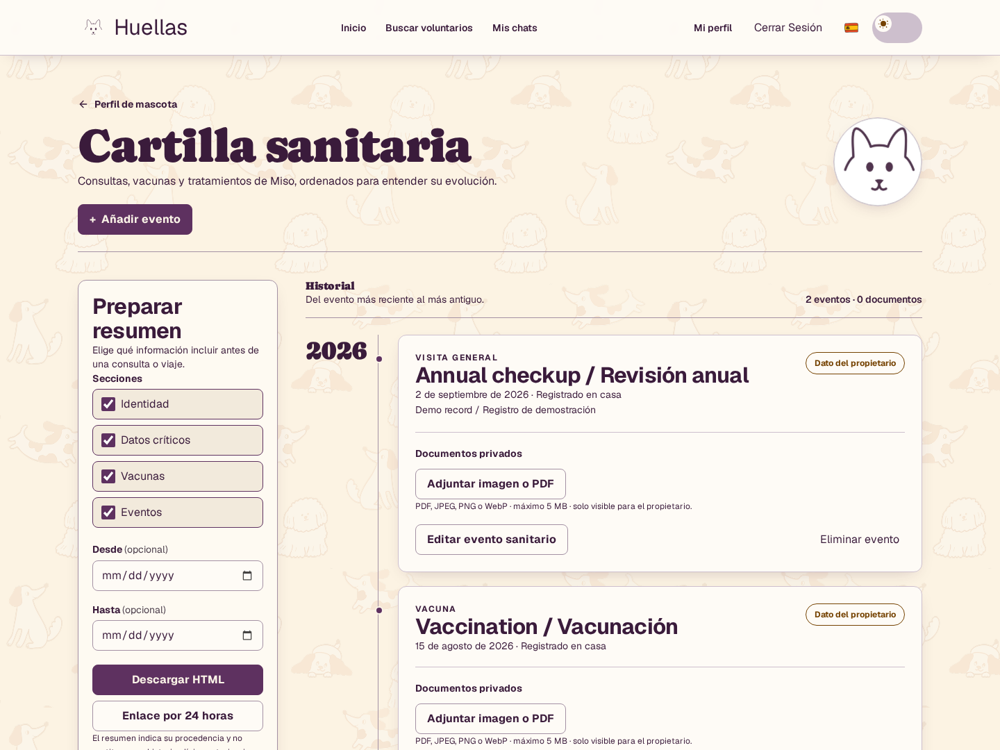
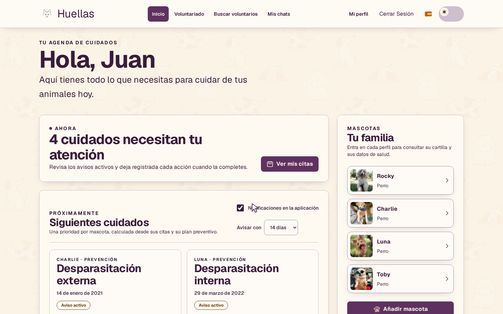
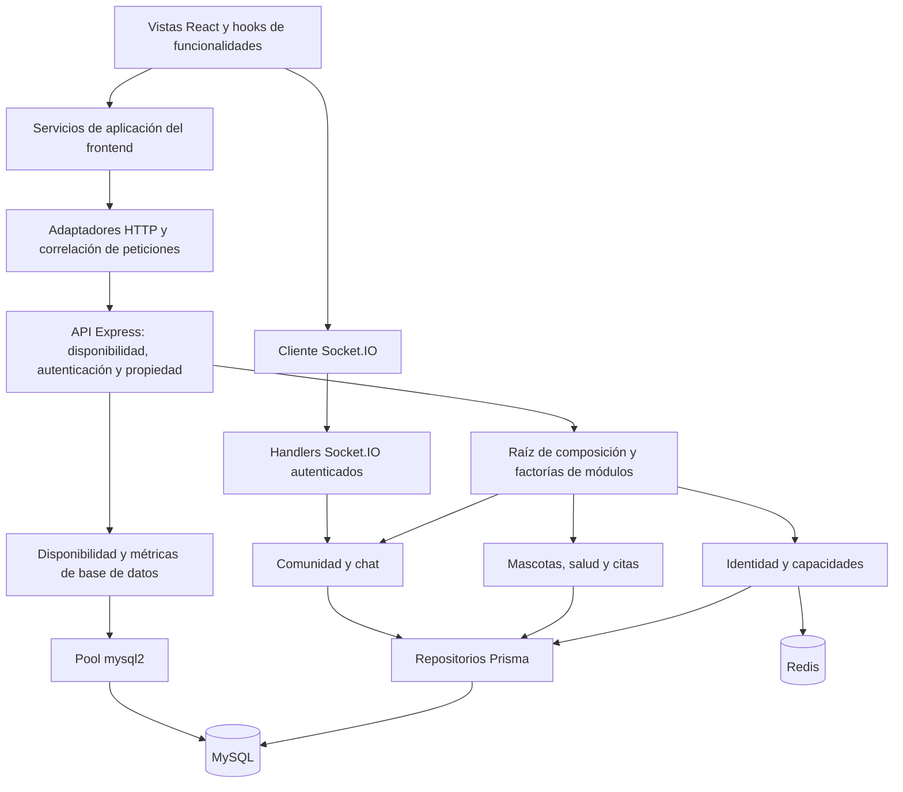

# Huellas

[English version](README.md)

[](https://github.com/kevin0018/Huellas/actions/workflows/ci.yml)

Aplicación full-stack para cuidar de tus mascotas: reúne su historial de salud,
citas y próximos cuidados preventivos. Conserva los datos importantes de cada
mascota en un solo lugar, con una interfaz en español, inglés y catalán.

[Ver el tour](docs/media/huellas-tour.mp4) · [Ejecutar la demo local](#demo-local-con-docker) · [Galería de la interfaz](#interfaz) · [Operación de la API](docs/OPERATIONS.md)

[](docs/huellas-preview-es.png)

Captura real de la aplicación con una cuenta y una mascota ficticias. El
repositorio no configura una URL de demo pública; las instrucciones de abajo
permiten ejecutar la aplicación en local.

## Funcionalidades

- Perfiles de mascotas con alergias, medicación, condiciones médicas y una URL de imagen persistida.
- Historial de eventos de salud, documentos adjuntos privados y exportación de un resumen HTML.
- Cuidados preventivos calculados a partir del historial y las pautas configuradas, con estados vencidos, próximos y al día.
- Gestión de citas y una bandeja de recordatorios dentro de la aplicación, que permite completarlos o posponerlos.
- Enlaces de resumen de salud con caducidad y revocación; las secciones y el intervalo de fechas seleccionados determinan qué se comparte.
- Capacidades de propietario y voluntario, tablón comunitario y chat autenticado con Socket.IO.
- Interfaz en español, inglés y catalán, fechas localizadas, temas claro/oscuro, diálogos accesibles con teclado y soporte de movimiento reducido.
- Controles para mostrar contraseñas con un gato SVG propio que sigue el cursor y reacciona a la escritura.

## Interfaz

[](docs/media/huellas-tour.mp4)

[Ver el recorrido guiado (MP4 · 3:10 · 12,2 MB)](docs/media/huellas-tour.mp4): Inicio, Nosotros,
el gato del login, panel de cuidados, perfil de mascota, cartilla, plan preventivo,
citas, registro, perfil de usuario, comunidad y chat. Grabado en español, con
temas claro/oscuro y cambios reales a inglés y catalán.

La grabación usa la cuenta local de Juan y las fotos existentes de sus mascotas.
Muestra la aplicación en funcionamiento; el texto visible en el campo de contraseña
es solo un ejemplo para enseñar el gato y la contraseña de la cuenta queda oculta.

[Cartilla en español](docs/huellas-preview-es.png) · [Health record in English](docs/huellas-preview.png) · [Vídeo del prototipo original](docs/media/legacy-demo.mp4)

El vídeo del prototipo original se conserva como referencia histórica.
Las capturas de la cartilla proceden de una compilación de producción del frontend conectada
a la API real con datos de demostración desechables; los registros médicos
son ficticios.

## Arquitectura



El backend es un **monolito modular** construido de forma incremental. Su raíz
de composición es
[`createApplicationModules.ts`](backend/src/composition/createApplicationModules.ts).
Los módulos usan reglas de dominio, servicios de aplicación y adaptadores de
infraestructura donde esas fronteras resultan útiles. Los repositorios Prisma
persisten los datos del producto; un pool mysql2 independiente sirve a las
comprobaciones de disponibilidad y las métricas. La separación en capas varía
según el módulo.

El frontend se organiza en `app/`, `features/`, `modules/` y `shared/`, mientras
que `Views/` y `Components/` contienen la interfaz.
[`applicationServices.ts`](frontend/src/composition/applicationServices.ts)
compone los adaptadores compartidos. Las rutas privadas validan la sesión remota
y usan las capacidades que devuelve la API. El servidor mantiene la autoridad
sobre las comprobaciones de propiedad.

## Decisiones que merece la pena revisar

- **Un historial de salud:** los eventos registrados por el propietario son editables; los verificados, vinculados a citas o heredados permanecen en modo de lectura.
- **Cuidados preventivos derivados:** se prueban la recurrencia y los límites de fechas, incluidos los años bisiestos, en lugar de guardar un segundo estado editable.
- **Propiedad en la API:** las comprobaciones HTTP y WebSocket protegen los recursos privados aunque un cliente evite la navegación prevista.
- **Traducción en la presentación:** las etiquetas de enumeraciones viven fuera del dominio; cambiar de idioma conserva el contenido del usuario y no vuelve a enviar las peticiones.
- **Fallos operativos explícitos:** `/live` comprueba el proceso; `/ready` consulta Prisma, mysql2 y Redis. La admisión de tráfico a la API depende de esa disponibilidad.
- **Observabilidad con datos limitados:** los logs JSON y las métricas agregadas omiten contenido de salud; los reportes del navegador admiten categorías fijas en lugar de mensajes o trazas.
- **Almacenamiento recuperable:** los backups cifrados de MySQL se autentican antes de importarlos y solo se restauran en una base nueva, con un ensayo reproducible de aislamiento.

## Stack

| Área | Implementación |
| --- | --- |
| Frontend | React 19, TypeScript 5, React Router 7, Vite 7, Tailwind CSS 4 |
| API | Node.js 22, Express 4, TypeScript 5, Socket.IO 4 |
| Persistencia | MySQL 8.4, Prisma 6.19.3, mysql2, Redis 7 |
| Operación | Docker Compose, logs JSON de peticiones, cliente Prometheus, backups AES-256-GCM |
| Verificación | Vitest 3, Testing Library, axe-core, Supertest, Playwright, comprobaciones de contrato OpenAPI |
| Herramientas | pnpm 10.10.0, ESLint, GitHub Actions |

Cada aplicación tiene su propio `package.json` y lockfile de pnpm. El repositorio
no tiene un workspace pnpm en la raíz; usa los comandos por paquete indicados abajo.

## Estructura del proyecto

```text
Huellas/
├── frontend/
│   ├── src/{app,features,modules,shared}/
│   ├── src/{Views,Components,Styles,i18n}/
│   ├── public/media/
│   └── e2e/                         # Recorridos reales de navegador y HTTP
├── backend/
│   ├── src/composition/             # Composición de módulos
│   ├── src/contexts/                # Capacidades de negocio
│   ├── src/{routes,middleware,observability}/
│   ├── src/contracts/openapi.ts
│   ├── prisma/                      # Esquema y migraciones versionadas
│   ├── scripts/                     # Backup cifrado y ensayo de recuperación
│   └── docker-compose.yml           # Entorno de desarrollo
├── compose.e2e.yml                  # Servicios MySQL/Redis desechables
├── docs/                            # Capturas y guía operativa
└── .github/workflows/ci.yml
```

## Demo local con Docker

Requiere Git y Docker con Compose. Esta opción no necesita Node instalado en
el equipo. Desde una copia nueva del repositorio:

```sh
git clone https://github.com/kevin0018/Huellas.git
cd Huellas
docker compose -f backend/docker-compose.yml up --build -d
docker compose -f backend/docker-compose.yml ps
```

Abre [Huellas en local](http://localhost:5173), crea una cuenta y añade una mascota.
La API aplica las migraciones antes de arrancar y el frontend espera a que esté
lista. No hace falta ejecutar el seed y el arranque no reinicia los datos existentes.

| Servicio | Dirección local |
| --- | --- |
| Frontend | http://localhost:5173 |
| API / OpenAPI | http://localhost:3000/api/openapi.json |
| Disponibilidad | http://localhost:3000/ready |
| MySQL | `127.0.0.1:3307` |
| Redis | `127.0.0.1:6379` |
| Adminer | http://localhost:8080 |

`FRONTEND_PORT`, `PORT` y `CORS_ORIGINS` permiten cambiar los puertos públicos y
los orígenes desde el entorno del proceso que ejecuta Compose. Vite redirige
`/api` y `/socket.io` a la API. Compose reserva el puerto 5555, pero no inicia
Prisma Studio automáticamente.

```sh
docker compose -f backend/docker-compose.yml logs --tail=100 api frontend
docker compose -f backend/docker-compose.yml down
```

`down` conserva los volúmenes de la base de datos. El siguiente comando opcional
**borra y sustituye los datos de la aplicación** por datos de desarrollo; úsalo
solo en una base desechable:

```sh
docker compose -f backend/docker-compose.yml exec api pnpm db:seed
```

## Ejecutar Node directamente en el equipo

Usa Node **22.x** (`nvm use` lee `.nvmrc`) y pnpm **10.10.0**. Para esta alternativa,
detén primero el stack completo de Compose para liberar los puertos. Copia los
ejemplos de entorno solo si los archivos `.env` correspondientes no existen:

```sh
corepack enable
corepack prepare pnpm@10.10.0 --activate
pnpm --dir backend install --frozen-lockfile
pnpm --dir frontend install --frozen-lockfile
test -e backend/.env || cp backend/.env.example backend/.env
test -e frontend/.env || cp frontend/.env.example frontend/.env
pnpm --dir backend prisma:generate
docker compose -f backend/docker-compose.yml up -d --wait mysql redis
pnpm --dir backend prisma:deploy
```

Los ejemplos apuntan a los servicios locales de Compose e incluyen credenciales
públicas **solo para desarrollo**. `DATABASE_URL` y las variables `DB_*` deben
apuntar a la misma base MySQL, de modo que la persistencia del producto y las
comprobaciones operativas consulten la misma base.

Ejecuta estos comandos en dos terminales:

```sh
pnpm --dir backend dev
pnpm --dir frontend dev
```

Si cambias el puerto de la API, configura `PORT` en `backend/.env` y pasa
`API_PROXY_TARGET` en el entorno del proceso del frontend. Mantén los orígenes
CORS alineados con la dirección real del frontend. El ejemplo `VITE_SOCKET_URL=/`
mantiene el chat en el mismo origen.

## Verificación

Desde la raíz del repositorio:

| Comprobación | Frontend | Backend |
| --- | --- | --- |
| Lint | `pnpm --dir frontend lint` | `pnpm --dir backend lint` |
| Tipos | `pnpm --dir frontend typecheck` | `pnpm --dir backend typecheck` |
| Pruebas rápidas | `pnpm --dir frontend test:run` | `pnpm --dir backend test` |
| Compilación | `pnpm --dir frontend build` | `pnpm --dir backend build` |

La base local actual es de **177 pruebas de frontend, 257 de backend y 26 E2E**.
La suite de navegador cubre recorridos reales de cuidados, denegaciones de acceso
por propiedad, cambios de contraseña e idioma, diseños responsive y endpoints
operativos. Las pruebas de backend también comprueban contratos, reglas de
recurrencia y fallos de dependencias.

```sh
pnpm --dir frontend exec playwright install --with-deps chromium
docker compose -f compose.e2e.yml up -d --wait
pnpm --dir frontend test:e2e
pnpm --dir backend db:test-recovery
docker compose -f compose.e2e.yml down
```

Estos servicios usan puertos propios y datos efímeros. Consulta la
[guía E2E](frontend/e2e/README.md) antes de cambiar sus conexiones.
El [workflow de CI](.github/workflows/ci.yml) define las comprobaciones de ambos
paquetes, la integración HTTP/navegador real y un job independiente de recuperación
cifrada. Se ejecuta en pull requests y pushes a `main`. El badge enlaza al historial
de ejecuciones remotas; los recuentos anteriores corresponden a verificación local.

## Despliegue y operación

Los Dockerfiles y el stack Compose incluidos son para **desarrollo**. Un entorno
de producción debe servir `frontend/dist` con fallback de SPA, redirigir `/api` y
`/socket.io` (incluida la actualización a WebSocket) y ejecutar el backend compilado
como proceso Node persistente conectado a MySQL y Redis. El servidor preview de
Vite sirve para comprobaciones locales.

Para un despliegue bajo el mismo origen, usa `VITE_API_URL=/api` y
`VITE_SOCKET_URL=/` al compilar el frontend. En el servidor configura
`NODE_ENV=production`, un `JWT_SECRET` privado, `CORS_ORIGINS` explícitos, Redis y
las conexiones Prisma/SQL a la misma base. Aplica `pnpm --dir backend prisma:deploy`,
compila ambos paquetes y ejecuta `pnpm --dir backend start`. Usa TLS y admisión de
tráfico condicionada a la disponibilidad de la API.

[OPERATIONS.md](docs/OPERATIONS.md) documenta los identificadores de correlación,
`/metrics` protegido, reportes acotados del navegador, apagado, backups cifrados y
recuperación. `METRICS_TOKEN` es un secreto operativo independiente y nunca una
variable del frontend. Los backups se ejecutan bajo demanda; su programación en
producción, retención externa y custodia de claves dependen del despliegue y no
se configuran automáticamente en este repositorio.

## Alcance, privacidad y atribuciones

Huellas organiza información de cuidados; no diagnostica ni sustituye el consejo
veterinario. Las pautas preventivas necesitan revisión profesional adecuada.
Los recordatorios actuales viven dentro de la aplicación; no hay envío de correo,
recuperación de contraseña por email ni integraciones con clínicas o aseguradoras.
El tablón y el chat no implican un servicio de moderación atendido ni un flujo de
permisos para cuidadores de confianza.

Las capturas de la cartilla y las pruebas usan datos sintéticos. Usa una cuenta desechable para
explorar el proyecto. Cualquier persona que tenga un enlace de resumen no caducado
puede leerlo; elige las secciones y revoca el acceso cuando termines. Los tokens de
sesión se guardan en localStorage del navegador. El proyecto no declara una
certificación de privacidad o seguridad; evalúa el despliegue antes de usar datos
personales o de salud reales.

La interfaz original, el logo y las ilustraciones de mascotas se atribuyen al
equipo del proyecto. Caprasimo y Geist se cargan mediante Google Fonts. Las
dependencias conservan sus propias licencias; no se ha declarado una licencia
general para el proyecto.

## Colaboradores

Todos los colaboradores participaron en frontend y backend. Las áreas principales
originales fueron:

- [Kevin Hernandez · @kevin0018](https://github.com/kevin0018): arquitectura, pruebas y backend.
- [Adriana Elias · @adriElias](https://github.com/adriElias): backend.
- [Aroa Granja · @MissAruru](https://github.com/MissAruru): diseño de interfaz, logo e identidad visual.
- [Fernanda Montalvan · @FerMon98](https://github.com/FerMon98): frontend.
