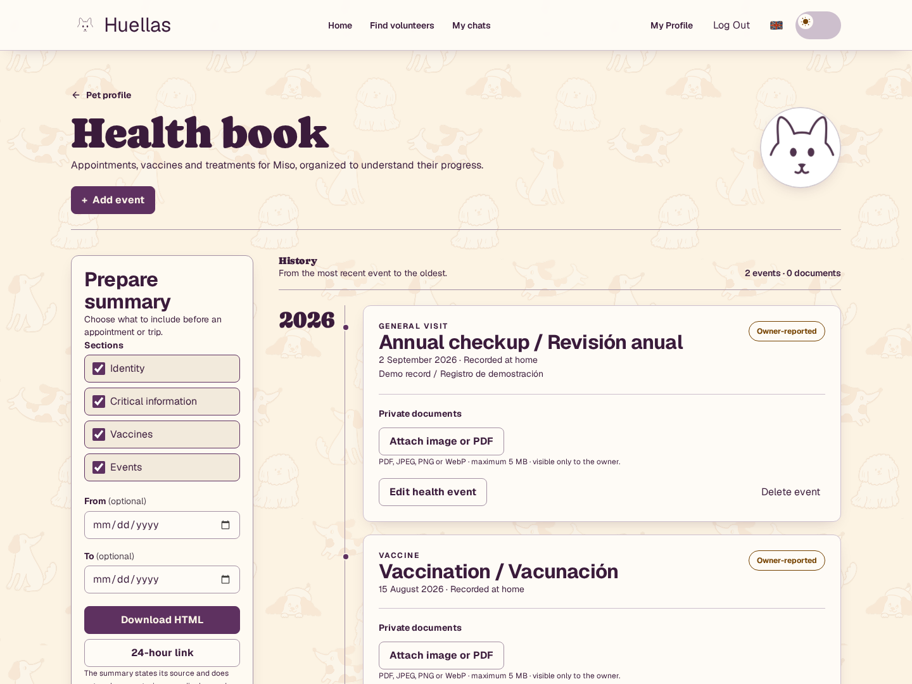
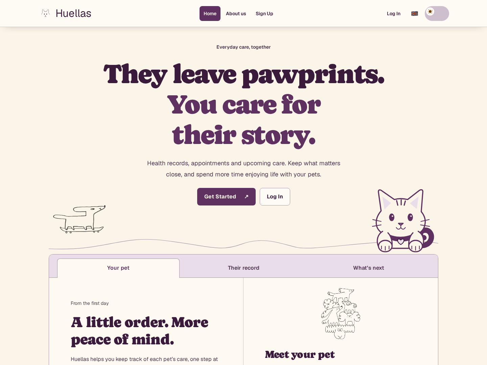
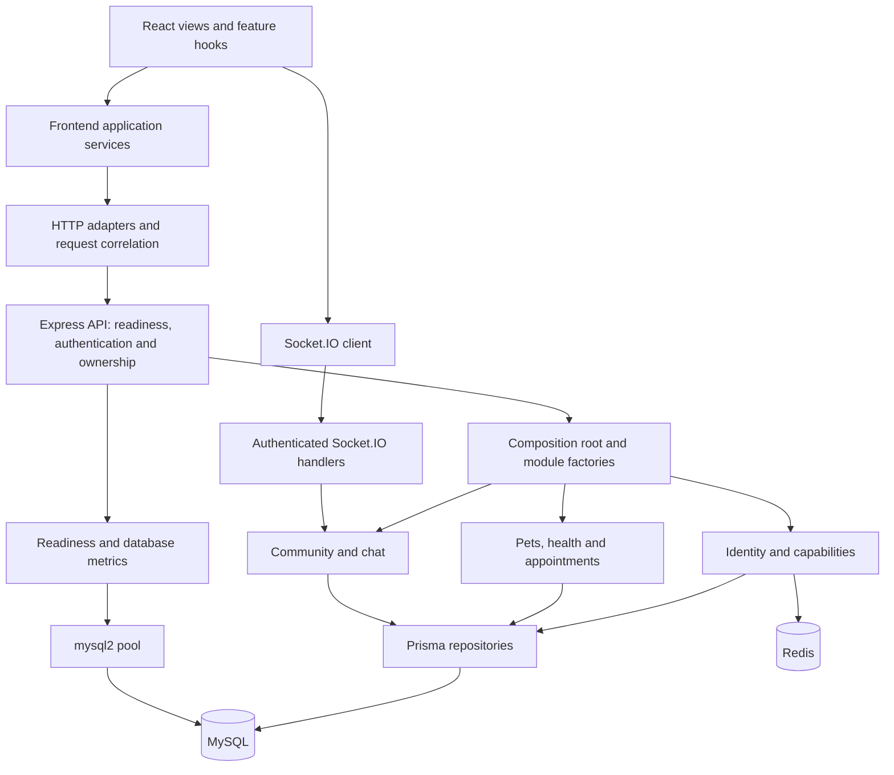

# Huellas

[Versión en español](README.es.md)

[](https://github.com/kevin0018/Huellas/actions/workflows/ci.yml)

A full-stack pet care application that brings health records, appointments and
upcoming preventive care together. Keep each pet's history and critical details
in one place, with an interface in English, Spanish and Catalan.

[Run the local demo](#local-demo-with-docker) · [Interface gallery](#interface) · [API operations](docs/OPERATIONS.md)

[](docs/huellas-preview.png)

Actual application capture with a fictional account and pet. No public hosted
demo URL is configured in this repository; the instructions below run the app locally.

## Highlights

- Pet profiles with allergies, medication, medical conditions and a persisted profile image URL.
- Health event history, private document attachments, and an HTML summary export.
- Preventive care calculated from recorded events and configured schedules, with overdue, upcoming and up-to-date states.
- Appointment management and an in-app reminder feed with completion and snoozing.
- Health summary links with expiry and revocation; selected sections and date ranges control what is shared.
- Owner and volunteer capabilities, a community board and authenticated Socket.IO chat.
- English, Spanish and Catalan UI, localized dates, light/dark themes, keyboard-accessible dialogs and reduced-motion support.
- Password visibility controls with a custom SVG cat that follows the cursor and reacts to password entry.

## Interface

[](docs/huellas-home.png)

[Health record in English](docs/huellas-preview.png) · [Cartilla en español](docs/huellas-preview-es.png) · [Original prototype video](docs/media/legacy-demo.mp4)

The video preserves the earlier prototype and does not represent the current UI.
The screenshots were captured from a production frontend build against the real
API using disposable demonstration data; their medical entries are fictional.

## Architecture



The backend is an incremental **modular monolith**. Its composition root is
[`createApplicationModules.ts`](backend/src/composition/createApplicationModules.ts).
Modules use domain rules, application services and infrastructure adapters where
those boundaries help. Prisma repositories handle product persistence; a separate
mysql2 pool supports readiness and database metrics. Layering varies by module.

The frontend is organized around `app/`, `features/`, `modules/` and `shared/`,
while `Views/` and `Components/` remain its delivery layer.
[`applicationServices.ts`](frontend/src/composition/applicationServices.ts) composes
shared adapters. Private routes validate the remote session and use API-provided
capabilities. HTTP ownership checks remain authoritative.

## Decisions worth reviewing

- **One health timeline:** owner-reported events can be edited; verified, appointment-linked and legacy events remain read-only.
- **Derived preventive care:** recurrence and date boundaries are tested, including leap years, instead of storing a second editable status.
- **Ownership at the API:** HTTP and WebSocket checks protect private resources even when a client bypasses navigation.
- **Translation at presentation boundaries:** enum labels live outside the domain; switching language preserves user content and does not resubmit requests.
- **Explicit operational failure:** `/live` checks the process; `/ready` checks Prisma, mysql2 and Redis. API admission depends on readiness.
- **Limited observability data:** JSON logs and aggregate metrics omit health content; browser reports accept fixed categories rather than messages or stacks.
- **Recoverable storage:** encrypted MySQL backups are authenticated before import and restored only into a new recovery database, with a repeatable isolation test.

## Stack

| Area | Implementation |
| --- | --- |
| Frontend | React 19, TypeScript 5, React Router 7, Vite 7, Tailwind CSS 4 |
| API | Node.js 22, Express 4, TypeScript 5, Socket.IO 4 |
| Persistence | MySQL 8.4, Prisma 6.19.3, mysql2, Redis 7 |
| Operations | Docker Compose, JSON request logs, Prometheus client, AES-256-GCM backups |
| Verification | Vitest 3, Testing Library, axe-core, Supertest, Playwright, OpenAPI contract checks |
| Tooling | pnpm 10.10.0, ESLint, GitHub Actions |

Each application has its own `package.json` and pnpm lockfile. This repository
does not have a root pnpm workspace; run the package commands shown below.

## Project structure

```text
Huellas/
├── frontend/
│   ├── src/{app,features,modules,shared}/
│   ├── src/{Views,Components,Styles,i18n}/
│   ├── public/media/
│   └── e2e/                         # Real browser and HTTP journeys
├── backend/
│   ├── src/composition/             # Module wiring
│   ├── src/contexts/                # Business capabilities
│   ├── src/{routes,middleware,observability}/
│   ├── src/contracts/openapi.ts
│   ├── prisma/                      # Schema and versioned migrations
│   ├── scripts/                     # Encrypted backup and recovery drill
│   └── docker-compose.yml           # Development stack
├── compose.e2e.yml                  # Disposable MySQL/Redis services
├── docs/                            # Screenshots and operational guide
└── .github/workflows/ci.yml
```

## Local demo with Docker

Requires Git and Docker with Compose. No host Node installation is needed for
this option. From a fresh checkout:

```sh
git clone https://github.com/kevin0018/Huellas.git
cd Huellas
docker compose -f backend/docker-compose.yml up --build -d
docker compose -f backend/docker-compose.yml ps
```

Open [Huellas locally](http://localhost:5173), create an account and add a pet.
The API applies migrations before starting; the frontend waits for API readiness.
No seed is required and existing records are not reset by startup.

| Service | Local address |
| --- | --- |
| Frontend | http://localhost:5173 |
| API / OpenAPI | http://localhost:3000/api/openapi.json |
| Readiness | http://localhost:3000/ready |
| MySQL | `127.0.0.1:3307` |
| Redis | `127.0.0.1:6379` |
| Adminer | http://localhost:8080 |

`FRONTEND_PORT`, `PORT` and `CORS_ORIGINS` can override public ports/origins in
the shell running Compose. Vite proxies `/api` and `/socket.io` to the API.
Port 5555 is reserved by Compose; Prisma Studio is not started automatically.

```sh
docker compose -f backend/docker-compose.yml logs --tail=100 api frontend
docker compose -f backend/docker-compose.yml down
```

`down` retains database volumes. The optional command below **deletes and replaces
application data** with development fixtures; use it only on a disposable database:

```sh
docker compose -f backend/docker-compose.yml exec api pnpm db:seed
```

## Run Node processes on the host

Use Node **22.x** (`nvm use` reads `.nvmrc`) and pnpm **10.10.0**. Start this
alternative with the full Compose stack stopped so ports are free. Copy the
environment examples only if the corresponding `.env` files do not exist:

```sh
corepack enable
corepack prepare pnpm@10.10.0 --activate
pnpm --dir backend install --frozen-lockfile
pnpm --dir frontend install --frozen-lockfile
test -e backend/.env || cp backend/.env.example backend/.env
test -e frontend/.env || cp frontend/.env.example frontend/.env
pnpm --dir backend prisma:generate
docker compose -f backend/docker-compose.yml up -d --wait mysql redis
pnpm --dir backend prisma:deploy
```

The examples target the local Compose services and contain public
**development-only** credentials.
`DATABASE_URL` and the `DB_*` variables must address the same MySQL database,
so product persistence and operational checks use the same database.

Run these commands in two terminals:

```sh
pnpm --dir backend dev
pnpm --dir frontend dev
```

For a different API port, set `PORT` in `backend/.env` and pass `API_PROXY_TARGET`
in the frontend process environment. Keep CORS origins aligned with the actual
frontend address. The example `VITE_SOCKET_URL=/` keeps chat on the same origin.

## Verification

From the repository root:

| Check | Frontend | Backend |
| --- | --- | --- |
| Lint | `pnpm --dir frontend lint` | `pnpm --dir backend lint` |
| Typecheck | `pnpm --dir frontend typecheck` | `pnpm --dir backend typecheck` |
| Fast tests | `pnpm --dir frontend test:run` | `pnpm --dir backend test` |
| Build | `pnpm --dir frontend build` | `pnpm --dir backend build` |

The current local baseline is **177 frontend tests, 257 backend tests and 26 E2E**.
The browser suite covers real care journeys, ownership denials, password changes,
language switching, responsive layouts and operational endpoints. Backend tests
also check contracts, recurrence rules and dependency failures.

```sh
pnpm --dir frontend exec playwright install --with-deps chromium
docker compose -f compose.e2e.yml up -d --wait
pnpm --dir frontend test:e2e
pnpm --dir backend db:test-recovery
docker compose -f compose.e2e.yml down
```

These services use their own ports and ephemeral data. Read the
[E2E guide](frontend/e2e/README.md) before changing their connection settings.
The [CI workflow](.github/workflows/ci.yml) defines frontend/backend checks,
real HTTP/browser integration and a separate encrypted recovery job. It runs
on pull requests and pushes to `main`. The badge links to the remote run history;
the test counts above describe local verification.

## Deployment and operations

The included Dockerfiles and Compose stack are for **development**. A production
host must serve `frontend/dist` with SPA fallback, proxy `/api` and `/socket.io`
(including WebSocket upgrades), and run the built backend as a persistent Node
process connected to MySQL and Redis. Vite's preview server is for local checks.

Use `VITE_API_URL=/api` and `VITE_SOCKET_URL=/` at frontend build time for a
same-origin deployment. Configure `NODE_ENV=production`, a private `JWT_SECRET`,
explicit `CORS_ORIGINS`, Redis and matching Prisma/SQL database settings on the
server. Apply `pnpm --dir backend prisma:deploy`, build both packages, then run
`pnpm --dir backend start`. Use TLS and readiness-based traffic admission.

[OPERATIONS.md](docs/OPERATIONS.md) documents correlation IDs, the protected
`/metrics` endpoint, bounded browser reports, shutdown, encrypted backups and
recovery. `METRICS_TOKEN` is a separate operator secret, never a frontend variable.
Backups are on demand; production scheduling, off-host retention and key storage
are deployment responsibilities, not services automatically configured here.

## Scope, privacy and attribution

Huellas organizes care information; it is not a diagnostic tool or a substitute
for veterinary advice. Preventive schedules need appropriate professional review.
Current reminders are in-app; email delivery, email password recovery, clinic and
insurer integrations are not implemented. Community/chat features do not imply
a staffed moderation service or a trusted-caregiver permission workflow.

Screenshots and tests use synthetic data. Use a disposable account when exploring
the project. Shared summaries can be read by anyone holding an unexpired link;
choose sections deliberately and revoke access when finished. Session tokens are
stored in browser localStorage. This project does not claim a privacy or security
certification; assess the deployment before using real personal or health data.

The original interface, logo and pet illustrations are credited to the project
team. Caprasimo and Geist are loaded through Google Fonts. Dependencies retain
their own licenses; a project-wide license has not been declared.

## Contributors

All contributors worked across the frontend and backend. The original primary
focuses were:

- [Kevin Hernandez · @kevin0018](https://github.com/kevin0018): architecture, testing and backend.
- [Adriana Elias · @adriElias](https://github.com/adriElias): backend.
- [Aroa Granja · @MissAruru](https://github.com/MissAruru): interface design, logo and branding.
- [Fernanda Montalvan · @FerMon98](https://github.com/FerMon98): frontend.
